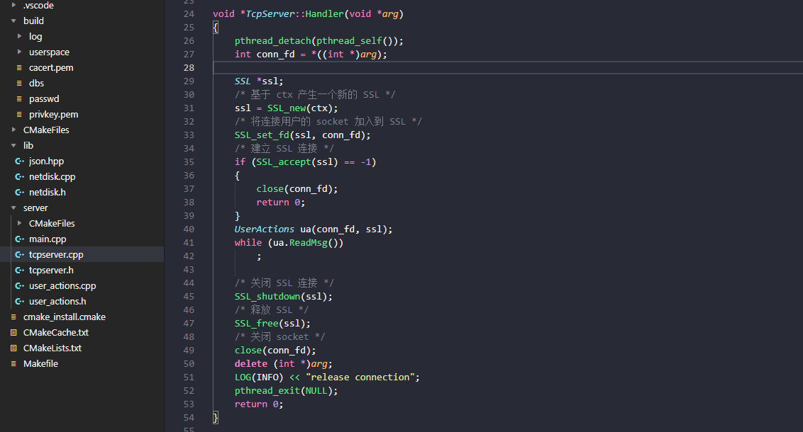
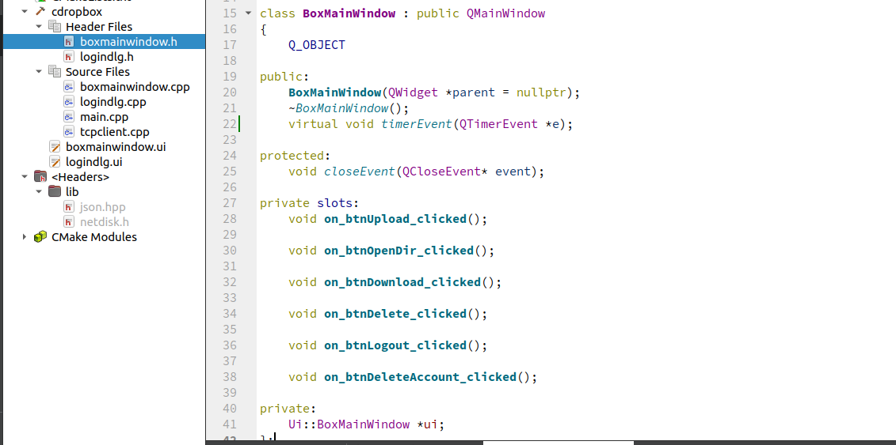
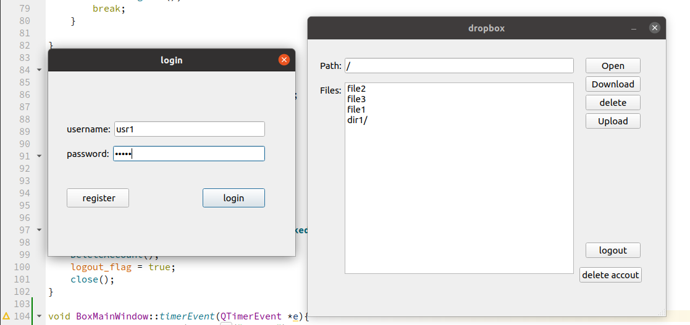

## 整体介绍  
---
使用C++编写，运行环境为linux。客户端使用qt creator完成基本ui设计，服务端无ui，使用日志系统输出运行信息。  

支持功能包括：  
- 用户登录、用户注册、登出账户、销毁账户  
- 文件上传、文件下载、文件删除、获取远程目录 
- openssl安全传输、keepalive、Cookie
- 日志系统

## 协议设计
---
控制协议包种类如下：

未定义
- UNDEFINE_TYPE 0
  
注册控制
- REGISTER_REQUEST 1 注册响应包。返回是否注册成功的信息。
- REGISTER_RESPONSE 2 注册响应包。返回是否注册成功的信息。
- REGISTER_DELETE 5 删除注册信息包。请求服务器彻底删除该用户的注册信息。

登录控制
- LOGIN_REQUEST 11 登录请求包。向服务器请求登录账户。
- LOGIN_RESPONSE 12 登录响应包。返回是否登录成功的信息。

目录访问
- CATALOG_REQUEST 21 远程目录请求包。请求服务器该用户的文件列表
- CATALOG_RESPONSE 22 远程目录响应包。服务器返回该用户的文件列表

文件访问
- FILE_REQUEST 31 文件请求包。发送请求的文件名和路径，请求下载该文件
- FILE_UPLOAD 32 文件上传包。上传即将传输的文件信息
- FILE_DELETE 33 文件删除请求。上传需要删除的文件信息
- FILE_METADATA 34 文件元数据。
- FILE_CONTENT 35 文件内容。

KeepAlive
- TCP_KEEPALIVE 41 keepalive包。

## 报文格式：  
---
- 包头(类型+包体大小）  包头大小固定
- 包体  包体大小不定  
  

报文类型为4字节的无符号整数，用来表明当前报文的类型。

包体大小也为4字节无符号整数，用来记录包体的长度。

包体本身可能包含目录信息，文件信息等，长度不固定。

## 整体开发
---
1. 服务端接收请求  
   绑定1777端口进行监听，当主线程有连接请求时，接收请求并创建一个新的线程。然后新的线程创建SSL，验证证书并建立SSL连接，然后进入对请求处理的循环中。
   

2. ui设计  
   ui使用qt creator进行开发，设计了  
   登录界面  
   - 用户名输入框
   - 密码输入框
   - 登录按键
   - 注册按键 

   主界面
   - 路径/文件名输入框
   - 打开目录按键
   - 文件上传按键
   - 文件下载按键
   - 文件删除按键
   - 内容输出区
   - 账户登出按键
   - 账户销毁按键
  
   点击登录、注册后，如果成功则转入dropbox主界面，如果失败会弹出失败提示框。

   点击上传按钮后，出现弹窗，可通过图形化交互的方式选择本地上的任意文件，点击open后即可上传到服务器。

   当关闭主界面/销毁账户时，会弹出确认提示框，点击yes后才会继续。

   点击账户登出按键后，会由主界面返回登录界面。点击账户销毁按键后，后弹出提示框，确认后返回登录界面。
   
   
   

## 功能设计
---
### 网盘功能
1. 获取远程目录  
   在输入框输入路径后，点击open按钮，客户端向服务器发送获取远程目录的请求，服务器收到请求后，将目录下文件内容格式化以json的方式填充到响应远程目录的包体中，向客户端发送。客户端收到后解析包体内容，将目录下的文件以qt creator中的item view的方式显示出来。
     
2. 下载文件  
   在输入框输入文件名或路径后，点击download按钮，客户端向服务器发送下载文件的请求，服务器会对路径进行检查（避免用户访问自己空间以外的地方），确认无误后，向客户端发送文件元数据信息和文件内容信息，客户端接收文件到当前目录下。
    
3. 上传文件  
   在通过图形化交互的方式选择本地上任意文件后，点击open将该文件路径传递给发送文件的模块，该模块将该文件发送至服务器。

4. 删除文件  
   在输入框输入文件名或路径后，点击delete按钮，客户端向服务器发送删除文件的请求，服务器会对路径进行检查（避免用户访问自己空间以外的地方），确认无误后，服务器将删除相应的文件。
   
5. openssl安全传输  
   控制消息，内容消息均使用openssl加密。服务器端需先生成证书和密钥，在编译过程中需使用ssl、crypto库。

6. keepalive  
   客户端使用startTimer方法定时触发keepalive包的发送。每次过去指定长的时间，客户端通过定时器触发执行timerEvent函数，向服务器发送keepalive包。

7. Cookie  
   在客户端登陆时，如果登录成功，服务器除了返回success的状态信息，同时还会返回set-cookie信息，cookie由一串二十位的数字/大写字母/小写字母组成。在客户端向服务器发送控制协议信息时，同时也包含cookie信息。服务器收到这些消息时，会先检查其中的cookie信息是否正确，只有正确才会进行后续的处理。每次登录，cookie都会被更新。
   

### 账户功能
1. 用户登录  
   用户输入账户名和密码后，点击login按钮，向服务器发送登录请求。服务器收到登录请求后，将会与本地保存的账户信息进行比对，查到对应的账户名且密码匹配后，服务器向客户端发送success的状态信息。客户端收到success信息后会转到dropbox的主界面，如果登录失败则会提示用户名或密码错误，此时用户需要重新输入。

2. 用户注册  
   用户输入账户名和密码后，点击register按钮，向服务器发送注册请求。服务器收到注册请求后，将会与本地保存的账户信息进行比对，如果没有查到对应的账户名，服务器将创建相应的资源以及该用户的网盘空间，将信息保存到本地，同时服务器向客户端发送success的状态信息。客户端收到success信息后会提示用户注册成功，此时用户可以通过login功能进行登入操作。

3. 登出账户  
   用户在dropbox主操作界面点击logout按钮，用户会登出账户，返回到login界面，等待用户新的登录/注册操作，或者是选择退出。

4. 删除账户  
   用户在dropbox主操作界面点击delete account按钮，会销毁账户，此操作不可逆。客户端会向服务器发送销毁账户的请求，服务器收到该请求后，会删除和该用户有关的信息。同时客户端会返回到login界面，等待用户新的登录/注册操作，或者是选择退出。

### extra
1. 日志系统  
   采用glog日志库。服务器启动时会创建log文件夹，其中存放日志信息。服务器在运行时产生的日志信息会同时输出到控制台和日志文件中。本项目主要使用INFO/WARNING/ERROR三个日志等级。
   
2. json序列化/反序列化  
   采用json for modern C++库。

3. 编译  
   客户端和服务器均使用CMake工具进行编译配置
   

